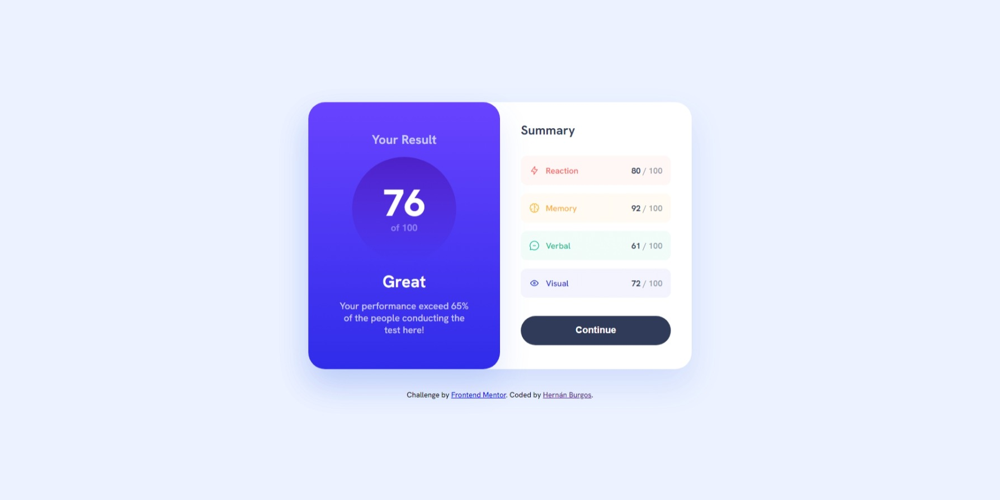

# Frontend Mentor - Results summary component solution



This is a solution to the [Results summary component challenge on Frontend Mentor](https://www.frontendmentor.io/challenges/results-summary-component-CE_K6s0maV). Frontend Mentor challenges help you improve your coding skills by building realistic projects. 

## Table of contents

- [Overview](#overview)
  - [The challenge](#the-challenge)
  - [Links](#links)
- [My process](#my-process)
  - [Built with](#built-with)
  - [What I learned](#what-i-learned)
  - [Continued development](#continued-development)
- [Author](#author)

## Overview

### The challenge

Users should be able to:

- View the optimal layout for the interface depending on their device's screen size
- See hover and focus states for all interactive elements on the page

### Links

- Solution URL: [GitHub Solution](https://github.com/burgosha/results-summary-component-main)
- Live Site URL: [live Site](https://bha-react-results-summary-component.netlify.app/)

## My process

### Built with

- Semantic HTML5 markup
- CSS custom properties
- Flexbox
- Mobile-first workflow
- [React](https://reactjs.org/) - JS library

### What I learned

With this activity I decided to test some basic knowledge of React. In the process I had to learn new methods, research and make my own code to achieve the goal.

One of the first problems was the import of the svg files, from the addresses provided in a json file:
```json
[
  {
    "category": "Reaction",
    "score": 80,
    "icon": "./assets/images/icon-reaction.svg"
  },
  {
    "category": "Memory",
    "score": 92,
    "icon": "./assets/images/icon-memory.svg"
  },
  {
    "category": "Verbal",
    "score": 61,
    "icon": "./assets/images/icon-verbal.svg"
  },
  {
    "category": "Visual",
    "score": 72,
    "icon": "./assets/images/icon-visual.svg"
  }
]
```
To accomplish this I used the map() method with the Score component and positioned the SVGs in the PUBLIC folder to render them.
```js
  {data.map((data) => {
    return <Score category={data.category} score={data.score} icon={data.icon} />;
    })
  }
```
In the Score component:
```js
    
```
Finally, a reduce() method was used to calculate the total score by reading the data.json file.
```js
function FinalScore(props) {
    return(
        <div className="result-score-container">
            <p className="result-score">
                {Math.floor(props.data.reduce((acc, curr) => acc + curr.score, 0) / props.data.length)}
            </p>
            <p className="of-100">
                of 100
            </p>
        </div>
    );
}
```


### Continued development

This has been one of the first projects with React that I want to develop as a practice, with my own solutions.

## Author

- Frontend Mentor - [@burgosha](https://www.frontendmentor.io/profile/burgosha)

